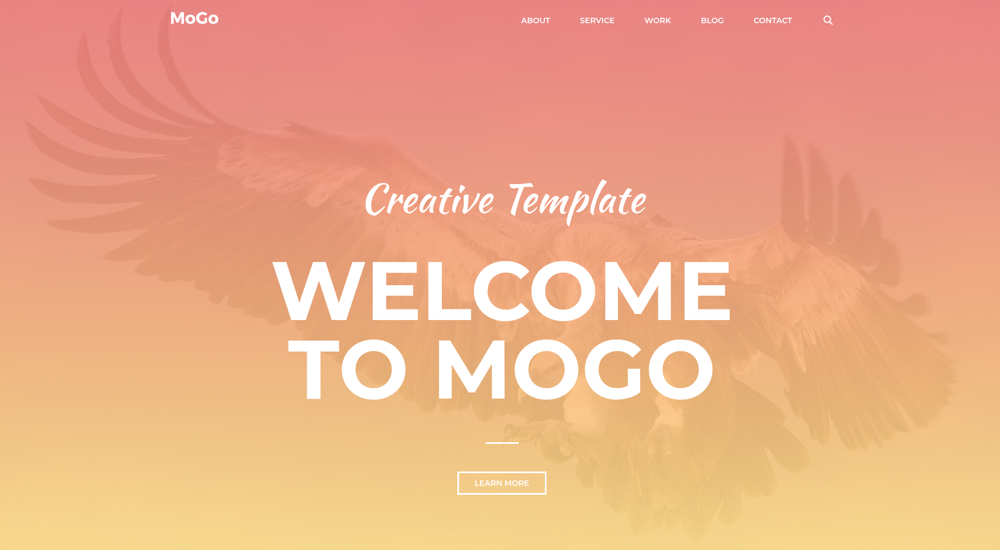

# MoGo template on Next.js
MoGo template is best suitable for agencies and featured by clean and modern design. <br> 
It includes many useful components like accordions, portfolio thumbnails, testimonial carousels and other widgets. <br>
Are you ready to get started?



## Demo
[Link](https://mogo-next-git-main-dexterwaspovs-projects.vercel.app?_vercel_share=uYyK4polCKHe9hTFgLr7d31kaSnL7wPl)

## Features 🌟
- 🚀 **Next.js 16** with App Router
- ✅ **TypeScript** for type checking
- 🎨 **Tailwind CSS 4** 
- 🚨 **ESLint** for linting
- 🗂️ Absolute imports with `@` prefix


## Next.js Components
- **Acccordion**
- **Parallax Banner**
- **Slider** (carousel)
- **Gallery**
- **Blog**
- **Portfolio**
- **Google Map**
- **Font Awesome** for icons
- **Fancybox**
- and others...

## Fully Responsive Design
- 📐 **Fluid Grid:** Interface elements dynamically resize and reposition to eliminate horizontal scrolling across all devices.
- 🏗️ **Modern Layouts:** Built using Flexbox and CSS Grid for robust, scalable, and efficient structural design.
- 💻 **Cross-Browser Compatibility:** Guaranteed stable performance and visual consistency across Chrome, Safari, Firefox, and Edge.
- 📱 **Mobile Optimization:** Features touch-friendly targets for seamless mobile use.
- 💎 **Retina Ready:** High-definition visuals using SVG and scalable fonts for perfect clarity on high-pixel-density displays.


## Requirements
Node.js and npm


## Getting Started
This is a [Next.js](https://nextjs.org) project bootstrapped with [`create-next-app`](https://nextjs.org/docs/app/api-reference/cli/create-next-app).

**Run the following commands on your local environment:**

```bash
npm install
npm run dev
```

Open [http://localhost:3000](http://localhost:3000) with your browser to see the result.
